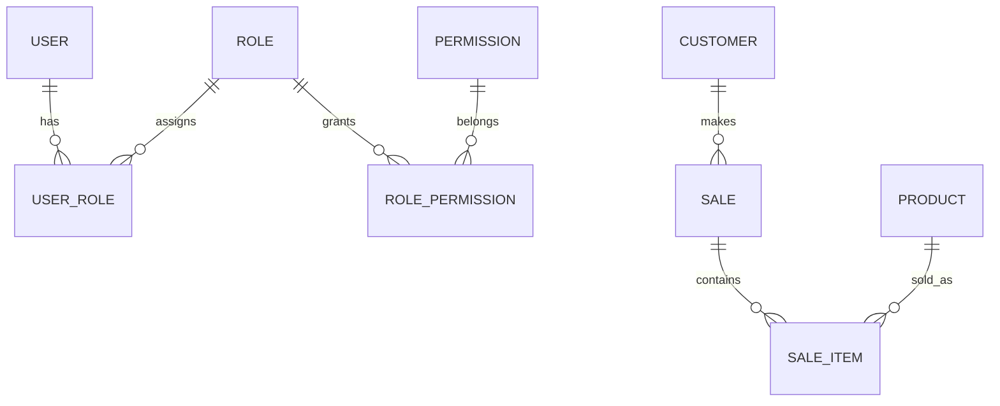

# ERD

## Entities
- **User**: system users with credentials.
- **Role**: groups of permissions.
- **Permission**: granular actions.
- **Customer**: retail customers.
- **Product**: sellable items.
- **Sale**: transaction header.
- **SaleItem**: line items for each sale.
